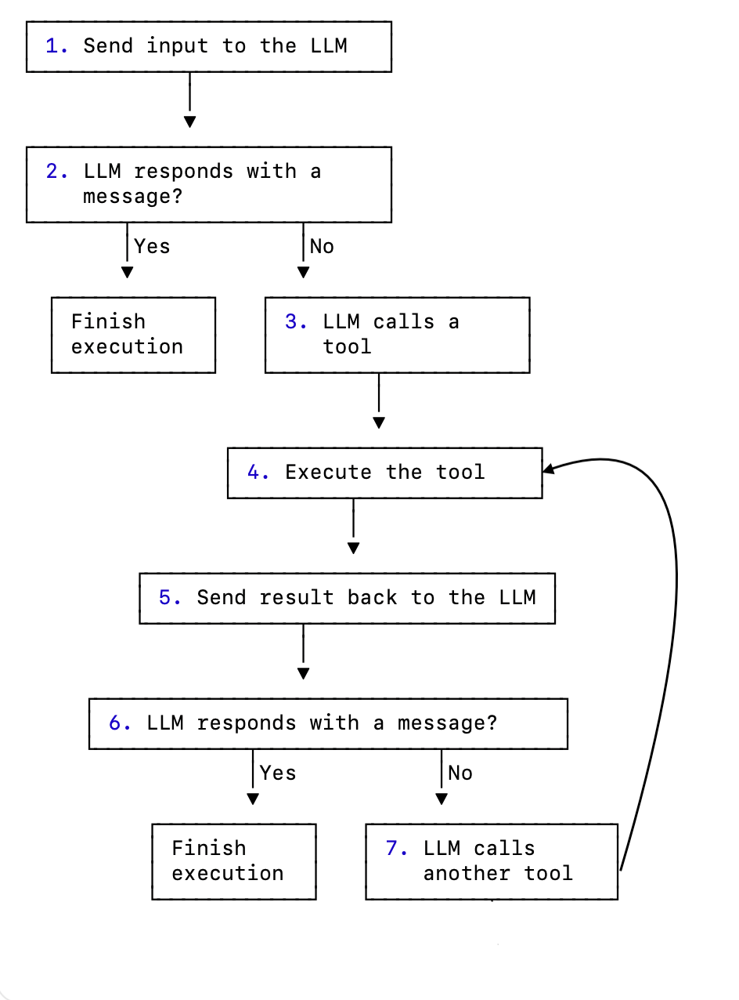

# Custom Strategy Graph Implementation Guide

Strategy graphs define the flow of execution in an agent, connecting nodes that perform specific operations to create
complex workflows.

## Introduction

Strategy graphs are the backbone of agent workflows in the Kotlin AI platform. They define how an agent processes input,
interacts with tools, and generates output. A strategy graph consists of nodes connected by edges, with conditions
determining the flow of execution.

Creating a custom strategy graph allows you to tailor the behavior of an agent to your specific needs, whether you're
building a simple chatbot, a complex data processing pipeline, or anything in between.

## Strategy Graph Architecture

At a high level, a strategy graph consists of the following components:

- **Strategy**: The top-level container for the graph, created using the `strategy` or `simpleStrategy` function.
- **Nodes**: Individual operations or transformations in the workflow.
- **Edges**: Connections between nodes that define the flow of execution.
- **Conditions**: Rules that determine when to follow a particular edge.

The execution of a strategy graph starts at a special node called `nodeStart` and ends at `nodeFinish`. The path taken
between these nodes depends on the edges and conditions defined in the graph.

## Creating a Basic Strategy Graph

Here's a simple example of creating a basic strategy graph:

```kotlin
val myStrategy = strategy("my-strategy") {
    val callLLM by nodeLLMRequest()
    val executeToolCall by nodeExecuteTool()
    val sendToolResult by nodeLLMSendToolResult()

    edge(nodeStart forwardTo callLLM)
    edge(callLLM forwardTo nodeFinish onAssistantMessage { true })
    edge(callLLM forwardTo executeToolCall onToolCall { true })
    edge(executeToolCall forwardTo sendToolResult)
    edge(sendToolResult forwardTo nodeFinish onAssistantMessage { true })
    edge(sendToolResult forwardTo executeToolCall onToolCall { true })
}
```

This strategy:

1. Sends the input to the LLM;
2. If the LLM responds with a message, finishes the execution;
3. If the LLM calls a tool, executes it;
4. Sends the tool result back to the LLM;
5. If the LLM responds with a message, finishes the execution;
6. If the LLM calls another tool, executes it, then the actions repeat from point 4.

We can visualize the graph as follows:



## Components of a Strategy Graph

### Nodes

Nodes are the building blocks of a strategy graph. Each node represents a specific operation or transformation in the
workflow. The Kotlin AI platform provides [several predefined nodes](nodes-and-components.md), and you can also create [custom nodes](custom-nodes.md).

Here are some commonly used predefined nodes:

- `nodeLLMRequest`: Sends the provided text together with the whole previous prompt history to the LLM and gets a response.
- `nodeExecuteTool`: Executes a tool call and returns the result.
- `nodeLLMSendToolResult`: Sends a tool result to the LLM and gets a response.
- `nodeLLMCompressHistory`: Compresses the conversation history to reduce token usage.

You can also create custom nodes using the `node` function:

```kotlin
val myCustomNode by node<String, Int> { input ->
    // Custom logic here
    input.length // Return the length of the input string
}
```

### Edges

Edges connect nodes and define the flow of execution in the strategy graph. An edge is created using the `edge` function
and the `forwardTo` infix function:

```kotlin
edge(sourceNode forwardTo targetNode)
```

You can also add conditions to edges to determine when to follow them:

```kotlin
edge(sourceNode forwardTo targetNode onCondition { input -> input.length > 10 })
```

### Conditions

Conditions determine when to follow a particular edge in the strategy graph. There are several types of conditions:

- `onCondition`: A general-purpose condition that takes a lambda returning a boolean.
- `onToolCall`: A condition that matches when the LLM calls a tool.
- `onAssistantMessage`: A condition that matches when the LLM responds with a message.

You can also transform the output before passing it to the target node:

```kotlin
edge(sourceNode forwardTo targetNode onCondition { input -> input.length > 10 } transformed { input -> input.uppercase() })
```

## Common Strategy Patterns

### Chat Strategy

A chat strategy is designed for interactive conversations with the user. It typically involves sending user input to the
LLM, executing tools as needed, and returning the LLM's response to the user.

Here's an example of a chat strategy:

```kotlin
fun chatAgentStrategy(): AIAgentStrategy = strategy("chat") {
    val callLLM by nodeLLMRequest()
    val nodeExecuteTool by nodeExecuteTool()
    val nodeSendToolResult by nodeLLMSendToolResult()

    val giveFeedbackToCallTools by node<String, Message.Response> { input ->
        llm.writeSession {
            updatePrompt {
                user("Don't chat with plain text! Call one of the available tools, instead: ${tools.joinToString(", ") { it.name }}")
            }

            requestLLM()
        }
    }

    edge(nodeStart forwardTo callLLM)

    edge(callLLM forwardTo nodeExecuteTool onToolCall { true })
    edge(callLLM forwardTo giveFeedbackToCallTools onAssistantMessage { true })
    edge(giveFeedbackToCallTools forwardTo giveFeedbackToCallTools onAssistantMessage { true })
    edge(giveFeedbackToCallTools forwardTo nodeExecuteTool onToolCall { true })
    edge(nodeExecuteTool forwardTo nodeSendToolResult)
    edge(nodeSendToolResult forwardTo nodeFinish onAssistantMessage { true })
    edge(nodeSendToolResult forwardTo nodeExecuteTool onToolCall { true })
    edge(nodeExecuteTool forwardTo nodeFinish onToolCall { tc -> tc.tool == "__exit__" } transformed { "Chat finished" })
}
```

### Single Run Strategy

A single run (or one-shot) strategy is designed for non-interactive use cases where the agent processes input once and
returns a result. It's simpler than a chat strategy because it doesn't need to handle ongoing conversations.

Here's an example of a single run strategy:

```kotlin
fun singleRunStrategy(): AIAgentStrategy = strategy("single_run") {
    val callLLM by nodeLLMRequest()
    val nodeExecuteTool by nodeExecuteTool()
    val nodeSendToolResult by nodeLLMSendToolResult()

    edge(nodeStart forwardTo callLLM)
    edge(callLLM forwardTo nodeExecuteTool onToolCall { true })
    edge(callLLM forwardTo nodeFinish onAssistantMessage { true })
    edge(nodeExecuteTool forwardTo nodeSendToolResult)
    edge(nodeSendToolResult forwardTo nodeFinish onAssistantMessage { true })
    edge(nodeSendToolResult forwardTo nodeExecuteTool onToolCall { true })
}
```

### Tool-Based Strategy

A tool-based strategy is designed for workflows that heavily rely on tools to perform specific operations. It typically
involves executing tools based on the LLM's decisions and processing the results.

Here's an example of a tool-based strategy:

```kotlin
fun toolBasedStrategy(name: String, toolRegistry: ToolRegistry): AIAgentStrategy {
    return strategy(name) {
        val nodeSendInput by nodeLLMRequest()
        val nodeExecuteTool by nodeExecuteTool()
        val nodeSendToolResult by nodeLLMSendToolResult()

        // Define the flow of the agent
        edge(nodeStart forwardTo nodeSendInput)

        // If the LLM responds with a message, finish
        edge(
            (nodeSendInput forwardTo nodeFinish)
                    onAssistantMessage { true }
        )

        // If the LLM calls a tool, execute it
        edge(
            (nodeSendInput forwardTo nodeExecuteTool)
                    onToolCall { true }
        )

        // Send the tool result back to the LLM
        edge(nodeExecuteTool forwardTo nodeSendToolResult)

        // If the LLM calls another tool, execute it
        edge(
            (nodeSendToolResult forwardTo nodeExecuteTool)
                    onToolCall { true }
        )

        // If the LLM responds with a message, finish
        edge(
            (nodeSendToolResult forwardTo nodeFinish)
                    onAssistantMessage { true }
        )
    }
}
```

### Streaming Data Strategy

A streaming data strategy is designed for processing streaming data from the LLM. It typically involves requesting
streaming data, processing it as it arrives, and potentially calling tools with the processed data.

Here's an example of a streaming data strategy:

```kotlin
fun streamingDataStrategy(): AIAgentStrategy = strategy("streaming-data") {
    val processStreamingData by node<Unit, String> { _ ->
        val books = mutableListOf<Book>()
        val mdDefinition = markdownBookDefinition()

        llm.writeSession {
            val markdownStream = requestLLMStreaming(mdDefinition)
            parseMarkdownStreamToBooks(markdownStream).collect { book ->
                books.add(book)
                println("Parsed Book: ${book.bookName} by ${book.author}")
            }
        }

        formatOutput(books)
    }

    edge(nodeStart forwardTo processStreamingData)
    edge(processStreamingData forwardTo nodeFinish)
}
```

## Advanced Strategy Techniques

### History Compression

For long-running conversations, the history can grow large and consume a lot of tokens. You can use the
`nodeLLMCompressHistory` node to compress the history:

```kotlin
val compressHistory by nodeLLMCompressHistory<Message.Tool.Result>(
    strategy = HistoryCompressionStrategy.FromLastNMessages(10),
    preserveMemory = true
)

edge(
    (nodeExecuteTool forwardTo compressHistory)
            onCondition { _ -> llm.readSession { prompt.messages.size > 100 } }
)
edge(compressHistory forwardTo nodeSendToolResult)
```

### Parallel Tool Execution

For workflows that require executing multiple tools in parallel, you can use the `nodeExecuteMultipleTools` node:

```kotlin
val executeMultipleTools by nodeExecuteMultipleTools()
val processMultipleResults by nodeLLMSendMultipleToolResults()

edge(someNode forwardTo executeMultipleTools)
edge(executeMultipleTools forwardTo processMultipleResults)
```

You can also use the `toParallelToolCallsRaw` extension function for streaming data:

```kotlin
parseMarkdownStreamToBooks(markdownStream).toParallelToolCallsRaw(BookTool::class).collect()
```

### Conditional Branching

For complex workflows that require different paths based on certain conditions, you can use conditional branching:

```kotlin
val branchA by node<String, String> { input ->
    // Logic for branch A
    "Branch A: $input"
}

val branchB by node<String, String> { input ->
    // Logic for branch B
    "Branch B: $input"
}

edge(
    (someNode forwardTo branchA)
            onCondition { input -> input.contains("A") }
)
edge(
    (someNode forwardTo branchB)
            onCondition { input -> input.contains("B") }
)
```

## Best Practices

When creating custom strategy graphs, follow these best practices:

1. **Keep it simple**: Start with a simple graph and add complexity as needed.
2. **Use descriptive names**: Give your nodes and edges descriptive names to make the graph easier to understand.
3. **Handle edge cases**: Make sure your graph handles all possible paths and edge cases.
4. **Test thoroughly**: Test your graph with various inputs to ensure it behaves as expected.
5. **Document your graph**: Document the purpose and behavior of your graph for future reference.
6. **Reuse common patterns**: Use predefined strategies or common patterns as a starting point.
7. **Consider performance**: For long-running conversations, use history compression to reduce token usage.

## More Examples

### Tone Analysis Strategy

The Tone Analysis Strategy is a good example of a tool-based strategy that includes history compression:

```kotlin
fun toneStrategy(name: String, toolRegistry: ToolRegistry): AIAgentStrategy {
    return strategy(name) {
        val nodeSendInput by nodeLLMRequest()
        val nodeExecuteTool by nodeExecuteTool()
        val nodeSendToolResult by nodeLLMSendToolResult()
        val nodeCompressHistory by nodeLLMCompressHistory<Message.Tool.Result>()

        // Define the flow of the agent
        edge(nodeStart forwardTo nodeSendInput)

        // If the LLM responds with a message, finish
        edge(
            (nodeSendInput forwardTo nodeFinish)
                    onAssistantMessage { true }
        )

        // If the LLM calls a tool, execute it
        edge(
            (nodeSendInput forwardTo nodeExecuteTool)
                    onToolCall { true }
        )

        // If the history gets too large, compress it
        edge(
            (nodeExecuteTool forwardTo nodeCompressHistory)
                    onCondition { _ -> llm.readSession { prompt.messages.size > 100 } }
        )

        edge(nodeCompressHistory forwardTo nodeSendToolResult)

        // Otherwise, send the tool result directly
        edge(
            (nodeExecuteTool forwardTo nodeSendToolResult)
                    onCondition { _ -> llm.readSession { prompt.messages.size <= 100 } }
        )

        // If the LLM calls another tool, execute it
        edge(
            (nodeSendToolResult forwardTo nodeExecuteTool)
                    onToolCall { true }
        )

        // If the LLM responds with a message, finish
        edge(
            (nodeSendToolResult forwardTo nodeFinish)
                    onAssistantMessage { true }
        )
    }
}
```

This strategy:

1. Sends the input to the LLM
2. If the LLM responds with a message, finishes
3. If the LLM calls a tool, executes it
4. If the history is too large (more than 100 messages), compresses it before sending the tool result
5. Otherwise, sends the tool result directly
6. If the LLM calls another tool, executes it
7. If the LLM responds with a message, finishes

### Markdown Streaming Strategy

The Markdown Streaming Strategy is an example of a strategy that processes streaming data:

```kotlin
val agentStrategy = strategy("library-assistant") {
    val getMdOutput by node<Unit, String> { _ ->
        val books = mutableListOf<Book>()
        val mdDefinition = markdownBookDefinition()

        llm.writeSession {
            val markdownStream = requestLLMStreaming(mdDefinition)
            parseMarkdownStreamToBooks(markdownStream).collect { book ->
                books.add(book)
                println("Parsed Book: ${book.bookName} by ${book.author}")
            }
        }

        formatOutput(books)
    }

    edge(nodeStart forwardTo getMdOutput)
    edge(getMdOutput forwardTo nodeFinish)
}
```

This strategy:

1. Defines a custom node that requests streaming data from the LLM
2. Parses the streaming data into Book objects as it arrives
3. Formats the output and returns it
4. The flow is simple: start -> getMdOutput -> finish

## Troubleshooting

When creating custom strategy graphs, you might encounter some common issues. Here are some troubleshooting tips:

### Graph Doesn't Reach Finish Node

If your graph doesn't reach the finish node, check that:

- All paths from the start node eventually lead to the finish node
- Your conditions are not too restrictive, preventing edges from being followed
- There are no cycles in the graph that don't have an exit condition

### Tool Calls Not Being Executed

If tool calls are not being executed, check that:

- The tools are properly registered in the tool registry
- The edge from the LLM node to the tool execution node has the correct condition (`onToolCall { true }`)

### History Gets Too Large

If your history gets too large and consumes too many tokens, consider:

- Adding a history compression node
- Using a condition to check the size of the history and compress it when it gets too large
- Using a more aggressive compression strategy (e.g., `FromLastNMessages` with a smaller N)

### Unexpected Branching

If your graph takes unexpected branches, check that:

- Your conditions are correctly defined
- The conditions are evaluated in the expected order (edges are checked in the order they are defined)
- You're not accidentally overriding conditions with more general ones

### Performance Issues

If your graph has performance issues, consider:

- Simplifying the graph by removing unnecessary nodes and edges
- Using parallel tool execution for independent operations
- Compressing history more aggressively
- Using more efficient nodes and operations