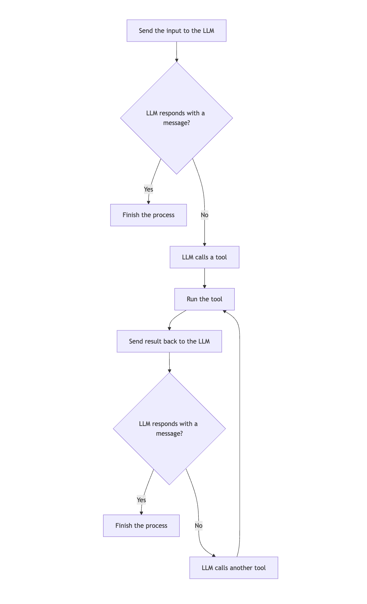

# Custom strategy graphs

Strategy graphs are the backbone of agent workflows in the Koog framework. They define how the agent processes input,
interacts with tools, and generates output. A strategy graph consists of nodes connected by edges, with conditions
determining the flow of execution.

Creating a strategy graph lets you tailor the behavior of an agent to your specific needs, whether you are
building a simple chatbot, a complex data processing pipeline, or anything in between.

## Strategy graph architecture

At a high level, a strategy graph consists of the following components:

- **Strategy**: the top-level container for the graph, created using the `strategy` function.
- **Subgraphs**: sections of the graph that can have their own set of tools and context.
- **Nodes**: individual operations or transformations in the workflow.
- **Edges**: connections between nodes that define the flow of agent operations.
- **Conditions**: rules that determine when to follow a particular edge.

The strategy graph begins at a special node called `nodeStart` and ends at `nodeFinish`.
The path between these nodes is determined by the edges and conditions specified in the graph.

## Strategy graph components

### Nodes

Nodes are building blocks of a strategy graph. Each node represents a specific operation or transformation in the
workflow.

The Koog framework provides predefined nodes and also lets you create custom nodes by using the `node` function.

For details, see [Predefined nodes and components](nodes-and-components.md) and [Custom nodes](custom-nodes.md).

### Edges

Edges connect nodes and define the flow of operation in the strategy graph.
An edge is created using the `edge` function and the `forwardTo` infix function:

```kotlin
edge(sourceNode forwardTo targetNode)
```

### Conditions

Conditions determine when to follow a particular edge in the strategy graph. There are several types of conditions:

| Condition type      | Description                                                                              |
|---------------------|------------------------------------------------------------------------------------------|
| onCondition         | A general-purpose condition that takes a lambda expression that returns a boolean value. |
| onToolCall          | A condition that matches when the LLM calls a tool.                                      |
| onAssistantMessage  | A condition that matches when the LLM responds with a message.                           |
| onMultipleToolCalls | A condition that matches when the LLM calls multiple tools.                              |
| onToolNotCalled     | A condition that matches when the LLM does not call a tool.                              |

You can transform the output before passing it to the target node by using the `transformed` function:

```kotlin
edge(sourceNode forwardTo targetNode 
        onCondition { input -> input.length > 10 }
        transformed { input -> input.uppercase() }
)
```

### Subgraphs

Subgraphs are sections of the strategy graph that operate with their own set of tools and context.
The strategy graph can contain multiple subgraphs. Each subgraph is defined by using the `subgraph` function:

```kotlin
val strategy = strategy("strategy-name") {
    val firstSubgraph by subgraph("first") {
        // Define nodes and edges for this subgraph
    }
    val secondSubgraph by subgraph("second") {
        // Define nodes and edges for this subgraph
    }
}
```
A subgraph can use any tool from a tool registry. 
However, you can specify a subset of tools from this registry that can be used in the subgraph and pass it as an argument to the `subgraph` function:

```kotlin
val strategy = strategy("strategy-name") {
    val firstSubgraph by subgraph(
        name = "first",
        tools = listOf(ToolName)
    ) {
        // Define nodes and edges for this subgraph
    }
   // Define other subgraphs
}
```

## Creating a basic strategy graph

The basic strategy graph operates as follows: 

1. Sends the input to the LLM.
2. If the LLM responds with a message, finishes the process.
3. If the LLM calls a tool, runs the tool.
4. Sends the tool result back to the LLM.
5. If the LLM responds with a message, finishes the process.
6. If the LLM calls another tool, runs the tool, and the process repeats from step 4.




Here is an example of a basic strategy graph:

```kotlin
val myStrategy = simpleStrategy("my-strategy") {
    val sendInput by nodeLLMSendStageInput()
    val executeToolCall by nodeExecuteTool()
    val sendToolResult by nodeLLMSendToolResult()

    edge(nodeStart forwardTo sendInput)
    edge(sendInput forwardTo nodeFinish onAssistantMessage { true })
    edge(sendInput forwardTo executeToolCall onToolCall { true })
    edge(executeToolCall forwardTo sendToolResult)
    edge(sendToolResult forwardTo nodeFinish onAssistantMessage { true })
    edge(sendToolResult forwardTo executeToolCall onToolCall { true })
}
```


## Common strategy patterns

### Chat strategy

A chat strategy is designed for interactive conversations with the user. It typically involves sending user input to the
LLM, executing tools as needed, and returning the LLM's response to the user.

Here's an example of a chat strategy:

```kotlin
fun chatAgentStrategy(): LocalAgentStrategy = simpleStrategy("chat") {
    val sendInput by nodeLLMSendStageInput("sendInput")
    val nodeExecuteTool by nodeExecuteTool("nodeExecuteTool")
    val nodeSendToolResult by nodeLLMSendToolResult("nodeSendToolResult")

    val giveFeedbackToCallTools by node<String, Message.Response> { input ->
        llm.writeSession {
            updatePrompt {
                user("Don't chat with plain text! Call one of the available tools, instead: ${tools.joinToString(", ") { it.name }}")
            }

            requestLLM()
        }
    }

    edge(nodeStart forwardTo sendInput)

    edge(sendInput forwardTo nodeExecuteTool onToolCall { true })
    edge(sendInput forwardTo giveFeedbackToCallTools onAssistantMessage { true })
    edge(giveFeedbackToCallTools forwardTo giveFeedbackToCallTools onAssistantMessage { true })
    edge(giveFeedbackToCallTools forwardTo nodeExecuteTool onToolCall { true })
    edge(nodeExecuteTool forwardTo nodeSendToolResult)
    edge(nodeSendToolResult forwardTo nodeFinish onAssistantMessage { true })
    edge(nodeSendToolResult forwardTo nodeExecuteTool onToolCall { true })
    edge(nodeExecuteTool forwardTo nodeFinish onToolCall { tc -> tc.tool == "__exit__" } transformed { "Chat finished" })
}
```

### Single run strategy

A single run (or one-shot) strategy is designed for non-interactive use cases where the agent processes input once and
returns a result. It's simpler than a chat strategy because it doesn't need to handle ongoing conversations.

Here's an example of a single run strategy:

```kotlin
fun singleRunStrategy(): LocalAgentStrategy = simpleStrategy("single_run") {
    val sendInput by nodeLLMSendStageInput("sendInput")
    val nodeExecuteTool by nodeExecuteTool("nodeExecuteTool")
    val nodeSendToolResult by nodeLLMSendToolResult("nodeSendToolResult")

    edge(nodeStart forwardTo sendInput)
    edge(sendInput forwardTo nodeExecuteTool onToolCall { true })
    edge(sendInput forwardTo nodeFinish onAssistantMessage { true })
    edge(nodeExecuteTool forwardTo nodeSendToolResult)
    edge(nodeSendToolResult forwardTo nodeFinish onAssistantMessage { true })
    edge(nodeSendToolResult forwardTo nodeExecuteTool onToolCall { true })
}
```

### Tool-based strategy

A tool-based strategy is designed for workflows that heavily rely on tools to perform specific operations. It typically
involves executing tools based on the LLM's decisions and processing the results.

Here's an example of a tool-based strategy:

```kotlin
fun toolBasedStrategy(name: String, toolRegistry: ToolRegistry, stageName: String): LocalAgentStrategy {
    return strategy(name) {
        stage(
            name = stageName,
            tools = toolRegistry.stagesToolDescriptors.getValue(stageName)
        ) {
            val nodeSendInput by nodeLLMSendStageInput()
            val nodeExecuteTool by nodeExecuteTool()
            val nodeSendToolResult by nodeLLMSendToolResult()

            // Define the flow of the agent
            edge(nodeStart forwardTo nodeSendInput)

            // If the LLM responds with a message, finish
            edge(
                (nodeSendInput forwardTo nodeFinish)
                        onAssistantMessage { true }
            )

            // If the LLM calls a tool, execute it
            edge(
                (nodeSendInput forwardTo nodeExecuteTool)
                        onToolCall { true }
            )

            // Send the tool result back to the LLM
            edge(nodeExecuteTool forwardTo nodeSendToolResult)

            // If the LLM calls another tool, execute it
            edge(
                (nodeSendToolResult forwardTo nodeExecuteTool)
                        onToolCall { true }
            )

            // If the LLM responds with a message, finish
            edge(
                (nodeSendToolResult forwardTo nodeFinish)
                        onAssistantMessage { true }
            )
        }
    }
}
```

### Streaming data strategy

A streaming data strategy is designed for processing streaming data from the LLM. It typically involves requesting
streaming data, processing it as it arrives, and potentially calling tools with the processed data.

Here's an example of a streaming data strategy:

```kotlin
fun streamingDataStrategy(): LocalAgentStrategy = simpleStrategy("streaming-data") {
    val processStreamingData by node<Unit, String> { _ ->
        val books = mutableListOf<Book>()
        val mdDefinition = markdownBookDefinition()

        llm.writeSession {
            val markdownStream = requestLLMStreaming(mdDefinition)
            parseMarkdownStreamToBooks(markdownStream).collect { book ->
                books.add(book)
                println("Parsed Book: ${book.bookName} by ${book.author}")
            }
        }

        formatOutput(books)
    }

    edge(nodeStart forwardTo processStreamingData)
    edge(processStreamingData forwardTo nodeFinish)
}
```

## Advanced strategy techniques

### History compression

For long-running conversations, the history can grow large and consume a lot of tokens. You can use the
`nodeLLMCompressHistory` node to compress the history:

```kotlin
val compressHistory by nodeLLMCompressHistory<Message.Tool.Result>(
    strategy = HistoryCompressionStrategy.FromLastNMessages(10),
    preserveMemory = true
)

edge(
    (nodeExecuteTool forwardTo compressHistory)
            onCondition { _ -> llm.readSession { prompt.messages.size > 100 } }
)
edge(compressHistory forwardTo nodeSendToolResult)
```

### Parallel tool execution

For workflows that require executing multiple tools in parallel, you can use the `nodeExecuteMultipleTools` node:

```kotlin
val executeMultipleTools by nodeExecuteMultipleTools()
val processMultipleResults by nodeLLMSendMultipleToolResults()

edge(someNode forwardTo executeMultipleTools)
edge(executeMultipleTools forwardTo processMultipleResults)
```

You can also use the `toParallelToolCallsRaw` extension function for streaming data:

```kotlin
parseMarkdownStreamToBooks(markdownStream).toParallelToolCallsRaw(BookTool::class).collect()
```

### Conditional branching

For complex workflows that require different paths based on certain conditions, you can use conditional branching:

```kotlin
val branchA by node<String, String> { input ->
    // Logic for branch A
    "Branch A: $input"
}

val branchB by node<String, String> { input ->
    // Logic for branch B
    "Branch B: $input"
}

edge(
    (someNode forwardTo branchA)
            onCondition { input -> input.contains("A") }
)
edge(
    (someNode forwardTo branchB)
            onCondition { input -> input.contains("B") }
)
```

## Best practices

When creating custom strategy graphs, follow these best practices:

1. **Keep it simple**: Start with a simple graph and add complexity as needed.
2. **Use descriptive names**: Give your nodes and edges descriptive names to make the graph easier to understand.
3. **Handle edge cases**: Make sure your graph handles all possible paths and edge cases.
4. **Test thoroughly**: Test your graph with various inputs to ensure it behaves as expected.
5. **Document your graph**: Document the purpose and behavior of your graph for future reference.
6. **Reuse common patterns**: Use predefined strategies or common patterns as a starting point.
7. **Consider performance**: For long-running conversations, use history compression to reduce token usage.
8. **Use stages appropriately**: Use stages to organize your graph and manage tool access.

## Usage Examples

### Tone analysis strategy

The tone analysis strategy is a good example of a tool-based strategy that includes history compression:

```kotlin
fun toneStrategy(name: String, toolRegistry: ToolRegistry, toneStageName: String): LocalAgentStrategy {
    return strategy(name) {
        stage(
            name = toneStageName,
            tools = toolRegistry.stagesToolDescriptors.getValue(toneStageName)
        ) {
            val nodeSendInput by nodeLLMSendStageInput()
            val nodeExecuteTool by nodeExecuteTool()
            val nodeSendToolResult by nodeLLMSendToolResult()
            val nodeCompressHistory by nodeLLMCompressHistory<Message.Tool.Result>()

            // Define the flow of the agent
            edge(nodeStart forwardTo nodeSendInput)

            // If the LLM responds with a message, finish
            edge(
                (nodeSendInput forwardTo nodeFinish)
                        onAssistantMessage { true }
            )

            // If the LLM calls a tool, execute it
            edge(
                (nodeSendInput forwardTo nodeExecuteTool)
                        onToolCall { true }
            )

            // If the history gets too large, compress it
            edge(
                (nodeExecuteTool forwardTo nodeCompressHistory)
                        onCondition { _ -> llm.readSession { prompt.messages.size > 100 } }
            )

            edge(nodeCompressHistory forwardTo nodeSendToolResult)

            // Otherwise, send the tool result directly
            edge(
                (nodeExecuteTool forwardTo nodeSendToolResult)
                        onCondition { _ -> llm.readSession { prompt.messages.size <= 100 } }
            )

            // If the LLM calls another tool, execute it
            edge(
                (nodeSendToolResult forwardTo nodeExecuteTool)
                        onToolCall { true }
            )

            // If the LLM responds with a message, finish
            edge(
                (nodeSendToolResult forwardTo nodeFinish)
                        onAssistantMessage { true }
            )
        }
    }
}
```

This strategy does the following:

1. Sends the input to the LLM
2. If the LLM responds with a message, finishes
3. If the LLM calls a tool, executes it
4. If the history is too large (more than 100 messages), compresses it before sending the tool result
5. Otherwise, sends the tool result directly
6. If the LLM calls another tool, executes it
7. If the LLM responds with a message, finishes

### Markdown streaming strategy

The Markdown Streaming Strategy is an example of a strategy that processes streaming data:

```kotlin
val agentStrategy = simpleStrategy("library-assistant") {
    val getMdOutput by node<Unit, String> { _ ->
        val books = mutableListOf<Book>()
        val mdDefinition = markdownBookDefinition()

        llm.writeSession {
            val markdownStream = requestLLMStreaming(mdDefinition)
            parseMarkdownStreamToBooks(markdownStream).collect { book ->
                books.add(book)
                println("Parsed Book: ${book.bookName} by ${book.author}")
            }
        }

        formatOutput(books)
    }

    edge(nodeStart forwardTo getMdOutput)
    edge(getMdOutput forwardTo nodeFinish)
}
```

This strategy:

1. Defines a custom node that requests streaming data from the LLM
2. Parses the streaming data into Book objects as it arrives
3. Formats the output and returns it
4. The flow is simple: start -> getMdOutput -> finish

## Troubleshooting

When creating custom strategy graphs, you might encounter some common issues. Here are some troubleshooting tips:

### Graph fails to reach finish node

If your graph doesn't reach the finish node, check:

- All paths from the start node eventually lead to the finish node.
- Your conditions are not too restrictive, preventing edges from being followed.
- There are no cycles in the graph that don't have an exit condition.

### Tool calls are not running

If tool calls are not running, check:

- The tools are properly registered in the tool registry.
- The stage has access to the tools.
- The edge from the LLM node to the tool execution node has the correct condition (`onToolCall { true }`).

### History gets too large

If your history gets too large and consumes too many tokens, consider:

- Adding a history compression node.
- Using a condition to check the size of the history and compress it when it gets too large.
- Using a more aggressive compression strategy (e.g., `FromLastNMessages` with a smaller N).

### Graph behaves unexpectedly

If your graph takes unexpected branches, check that:

- Your conditions are correctly defined.
- The conditions are evaluated in the expected order (edges are checked in the order they are defined).
- You're not accidentally overriding conditions with more general ones.

### Performance issues occur

If your graph has performance issues, consider:

- Simplifying the graph by removing unnecessary nodes and edges.
- Using parallel tool execution for independent operations.
- Compressing history more aggressively.
- Using more efficient nodes and operations.